First, clone the repo.
Then follow the steps below to import the image. From the repo you get `IOSvL2.yaml` and a `.qcow2` image file.

1. Login to the CML web UI, go to `TOOLS` -> `Node and Image Definitions`.

	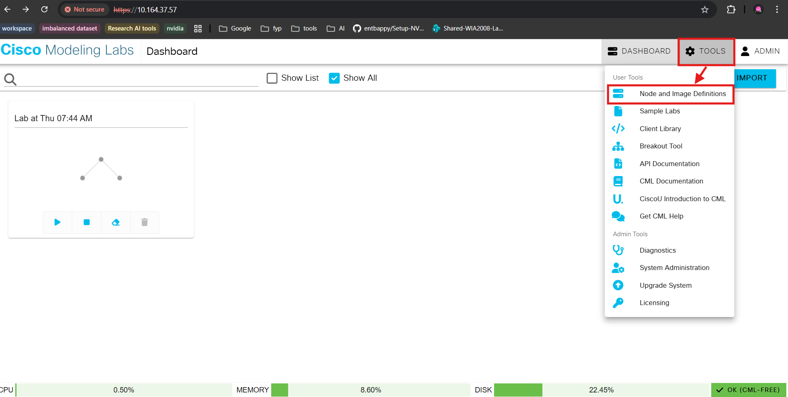

2. Click `Import` on the upper right, beside the `Add` button.

	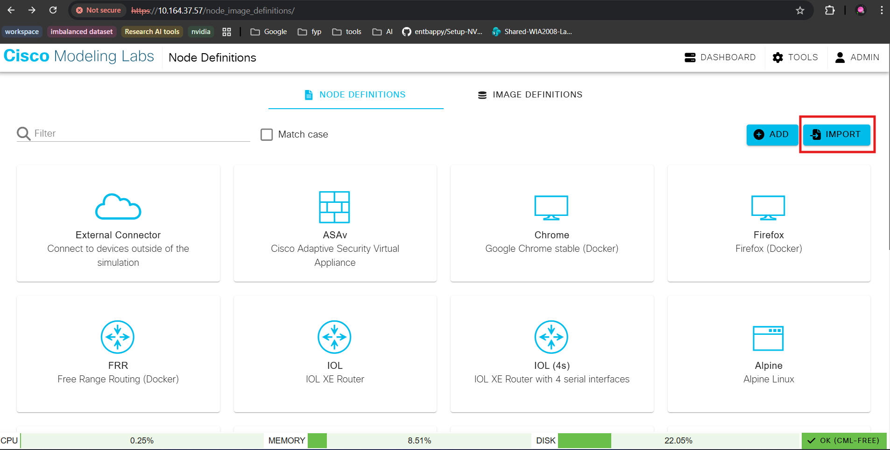

3. Click the node definition field to open the File Explorer, select `IOSvL2.yaml` from this repo, then click `Import`.

	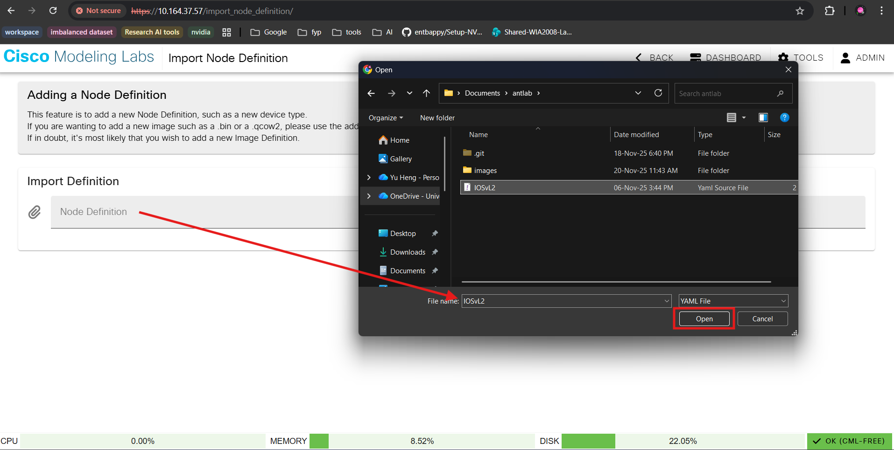

4. After the import completes click the `GO TO NODE DEFINITION` button.

	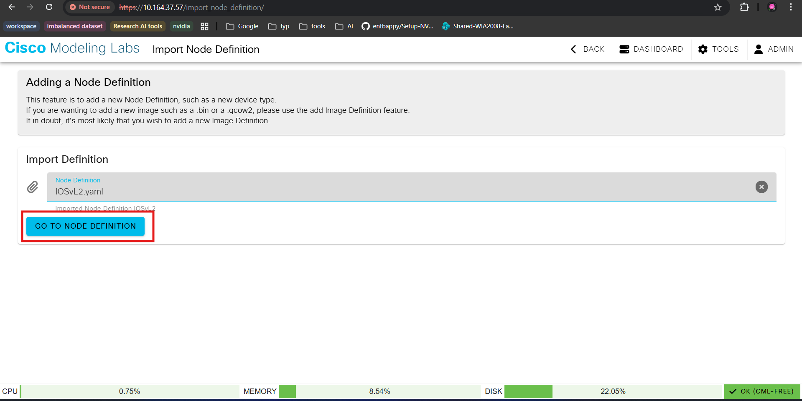

5. Click `CREATE NEW IMAGE DEFINITION`.

	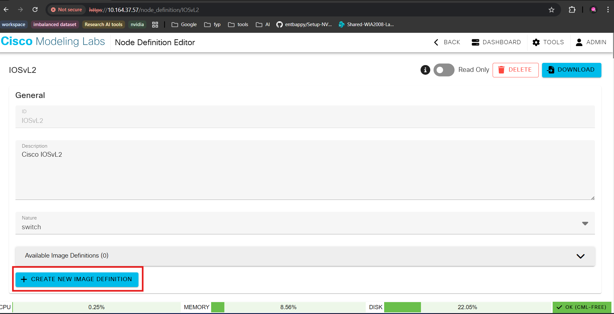

6. Click `MANAGE IMAGE UPLOADS` (or similar) to upload the disk image.

	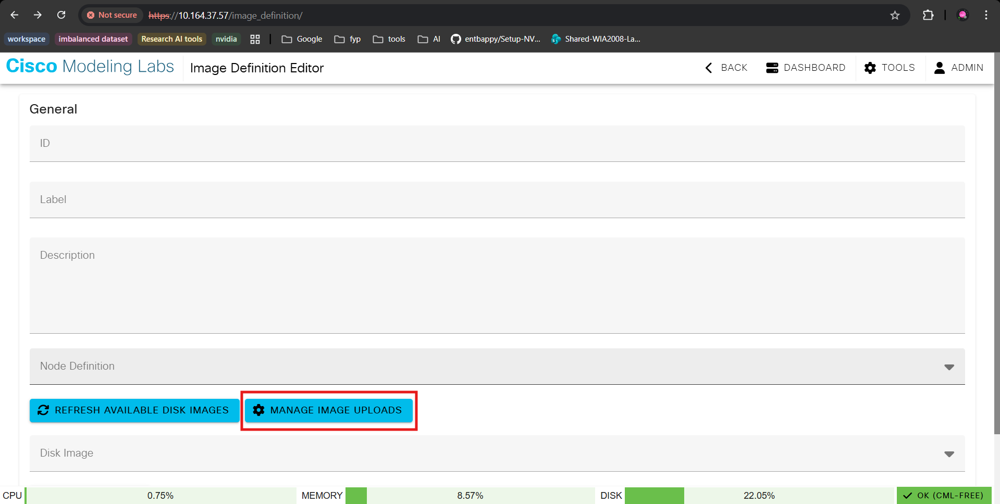

7. Click the Image File field, choose the provided `vios_l2-adventerprisek9-m.ssa.high_iron_20200929.qcow2` and upload it.

	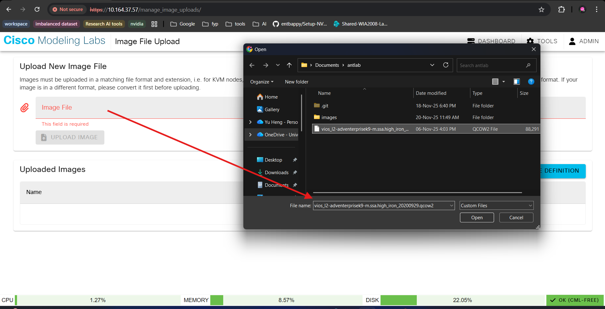

8. When the upload finishes you should see the file listed under **Uploaded Images**.

	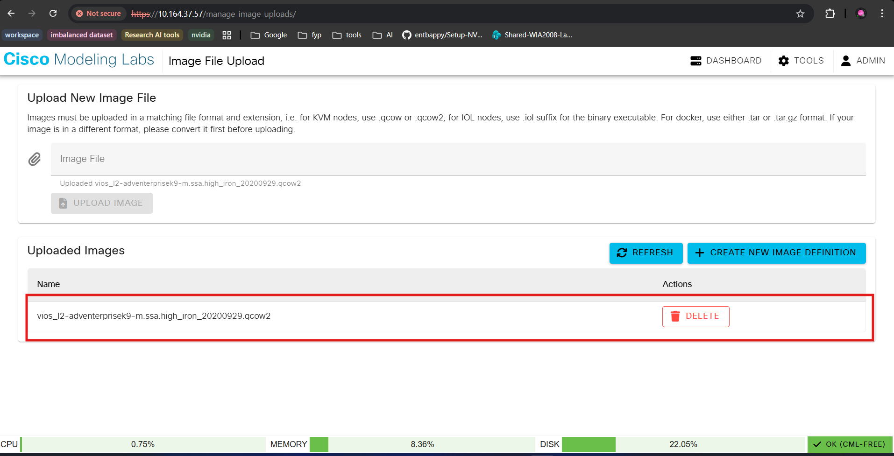

9. Click back to return to the Image Definition Editor. Select the imported node definition (the IOSvL2 node) as the **Node Definition** and choose the uploaded `.qcow2` file as the **Disk Image**. Fill in the `ID`, `Label`, and `Description` for the image definition.

	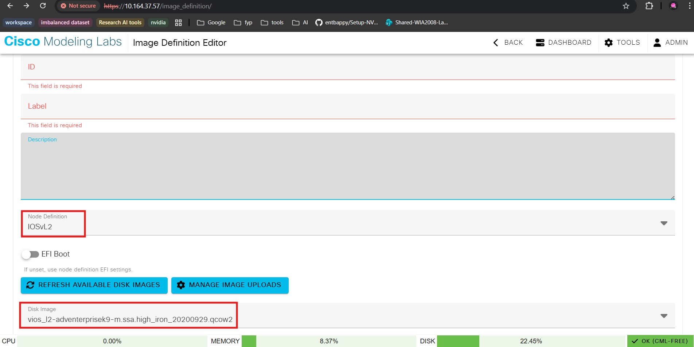

10. Then scroll down to click `CREATE IMAGE DEFINITION`.

11. You will now see the new node in `TOOLS` -> `Node and Image Definitions` and it should be available in the topology editor's node palette.

	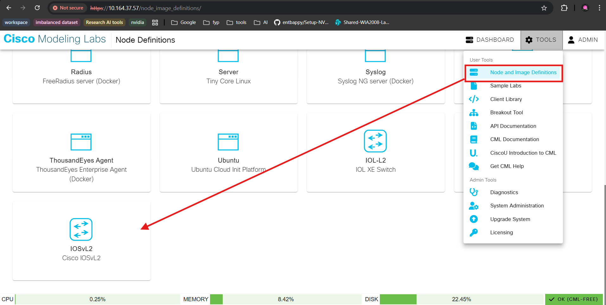

TESTING

- Add the new IOSvL2 node to a topology, connect it to other nodes and start the lab.
- Open the node console and apply a small configuration change, then save the running configuration.
- If you see "written to disk successfully" when saving, the node is functioning and configuration persistence is working.

	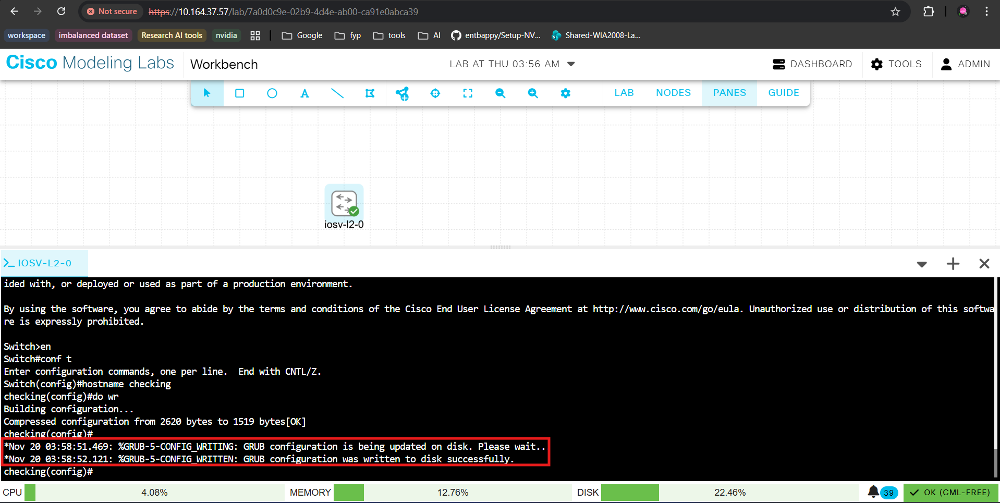